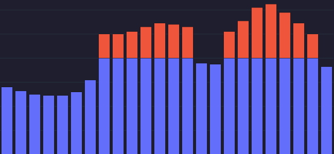
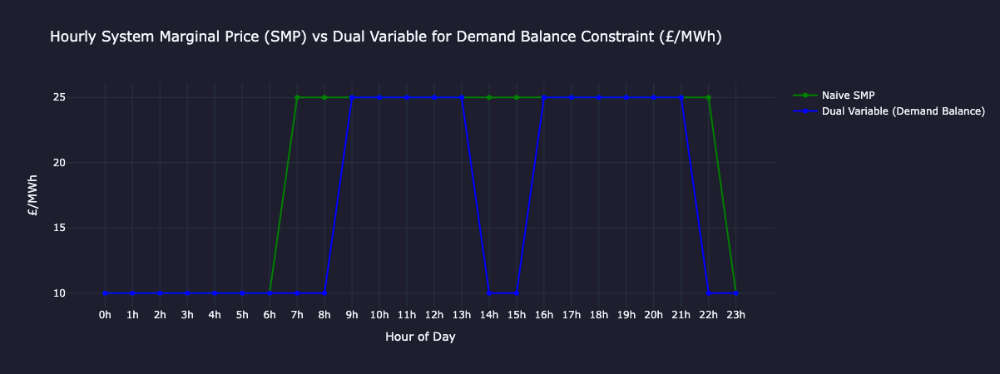
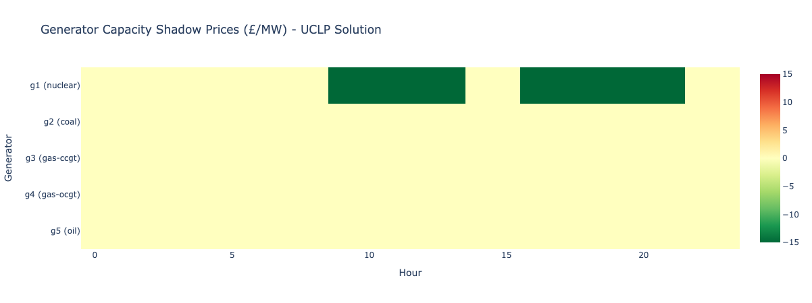
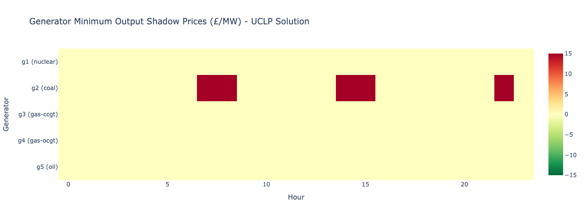

<p align="center">
  
</p>

# Power Market Modelling — Onboarding Exercise

This is a self-contained intro exercise for getting a feel for how electricity markets work and how optimisation is used to operate them. It was generated by Claude (Anthropic) as a learning exercise on request — the intent is to get hands-on with the core concepts before diving into real-world complexity.

---

## What this is

A 24-hour generator scheduling problem. You have a small fleet of five power plants and a demand profile. The challenge is to figure out which generators to run, when, and at what output — at minimum cost.

This touches two of the most fundamental problems in power systems:

- **Economic Dispatch** — given which generators are on, how much should each produce?
- **Unit Commitment** — which generators should be on at all?

These are real problems that grid operators and energy traders deal with every day.

---

## The exercise (in four parts)

### Part 1 — Greedy merit order dispatch
The simplest approach: just rank generators by marginal cost and fill demand from cheapest to most expensive. No startup costs, no minimum run times — just a greedy baseline.

You'll produce a generation mix chart and a System Marginal Price (SMP) curve. The SMP is the price set by the most expensive generator needed to meet demand — this is how real electricity markets price power.

### Part 2 — Unit Commitment with Linear Programming
Now add the real constraints: startup costs, minimum run times, minimum stable generation. Formulate this as a Mixed-Integer Linear Programme (MILP) using `PuLP` and solve it optimally.

You'll see how much cheaper the optimised schedule is versus the greedy one, and why — the solver avoids unnecessary start-ups and keeps cheap baseload (nuclear) running continuously.

### Part 3 — Analysis
Explore what the results mean: price duration curves, the effect of startup costs on the schedule, and identifying scarcity hours.

### Part 4 — Lagrange Multipliers, Dual Variables and Shadow Prices
Go deeper into the mathematics of the optimum. Fix the MILP binary solution and re-solve as a pure LP to extract dual variables — the shadow prices on each constraint. The demand balance shadow price is the formally derived SMP; the capacity shadow prices reveal which generators are actually constraining the system; and the minimum stable generation shadow price puts an explicit cost on the commitment decisions made in Part 2.

---

## Generator fleet

| Generator | Type       | Capacity (MW) | Marginal Cost (£/MWh) | Startup Cost (£) | Min Run Time (hrs) | Min Stable Generation (MW) |
|-----------|------------|:---:|:---:|:---:|:---:|:---:|
| G1        | Nuclear    | 400 | £10  | £50,000 | 8 | 150 |
| G2        | Coal       | 300 | £25  | £8,000  | 4 | 100 |
| G3        | Gas (CCGT) | 200 | £45  | £2,000  | 2 | 60  |
| G4        | Gas (OCGT) | 100 | £80  | £500    | 1 | 0   |
| G5        | Oil Peaker | 50  | £120 | £200    | 1 | 0   |

Nuclear is cheap to run but expensive to start and slow to ramp — it wants to run all day. Oil peakers are the opposite: expensive per MWh but quick and cheap to commit, so they only appear at peak hours.

---

## Key concepts you'll encounter

**System Marginal Price (SMP)** — the marginal cost of the last (most expensive) generator dispatched. All generators in the market receive this price, regardless of their own cost. This is why cheap generators are profitable.

**Merit order** — ranking generators by marginal cost. The cheapest runs first, the most expensive only when needed. The shape of this stack determines the price.

**MILP (Mixed-Integer Linear Programming)** — an optimisation technique where some variables are continuous (how much power to produce) and some are binary (on or off). The solver finds the globally optimal solution subject to all constraints.

**Startup cost vs marginal cost trade-off** — the tension at the heart of unit commitment. It might be cheaper to keep an expensive generator running overnight than to shut it down and pay to restart it the next morning.

**Lagrange multipliers and shadow prices** — in constrained optimisation, each constraint has a Lagrange multiplier λ that measures how much the optimal cost changes if that constraint is relaxed by one unit. In power systems these are called shadow prices: the demand balance shadow price is exactly the SMP (derived from duality, not from reading off the merit order), the capacity shadow price measures what an extra MW of generator headroom is worth, and the minimum stable generation shadow price quantifies the cost of operating floors.

**LP relaxation for dual variables** — the unit commitment problem is a MILP whose binary variables break strict duality theory. The standard fix is to lock the binary variables at their optimal values and re-solve as a pure LP; the resulting dual variables are well-defined and economically interpretable as local price signals around the optimal solution.

---

## Repository structure

```
├── task.md               # The original problem statement as given by Claude
├── my_solution.ipynb     # Main notebook — work through Parts 1–4 here
├── claude_solution.py    # Claude's own reference solution as a plain Python script
├── plotting.py           # Reusable Plotly chart functions used by the notebook
├── figures/              # Exported chart images referenced in this README
```

---

## How to run

```bash
pip install pulp plotly pandas tqdm
jupyter notebook my_solution.ipynb
```

The notebook is self-contained. `plotting.py` holds the reusable chart functions.

---

## Main Results (spoiler)

| Method | Marginal Cost | Startup Cost | Total Cost |
|---|---|---|---|
| Greedy merit order | £135,500 | £66,000 | £201,500 |
| MILP unit commitment | £137,100 | £58,000 | £195,100 |
| Saving | | | **£6,400** |

Note that the MILP actually has a slightly *higher* marginal cost than greedy — it trades a little extra running cost for significantly fewer start-ups, coming out ahead overall.

---

### Generation mix — greedy dispatch


The greedy solution is clean and intuitive: nuclear (G1) runs all 24 hours as the baseload, and coal (G2) fills in from hour 7 onwards when morning demand ramps above nuclear's 400 MW capacity. The three gas and oil generators are never needed — this demand profile is comfortably within the two cheapest generators. The night trough (hours 0–6) and late evening (hour 23) are nuclear-only, setting the SMP at £10/MWh.

---

### Generation mix — MILP (unit commitment) dispatch


The MILP schedule looks similar at a glance, but there is a key difference at hours 14–15, where demand dips to ~375–380 MW — within nuclear's solo capacity. The greedy solution switches coal off; the MILP keeps it running at its minimum stable generation (100 MW), with nuclear backing off to compensate. This is the minimum run time constraint in action: coal was committed in the morning and must run for at least 4 hours, so the solver finds it cheaper to leave it idling than to incur another £8,000 startup later in the evening peak.

---

### SMP comparison — greedy vs MILP


Both solutions produce the same SMP curve for the vast majority of the day: £10/MWh overnight (nuclear is the marginal unit) and £25/MWh through the daytime (coal is marginal). The two lines are nearly identical, which tells you something important: the *commitment* decisions changed, but the *price signal* is almost unaffected. In real markets, small changes in which unit is marginal can have large price implications — this problem is simple enough that it doesn't show that complexity.

---

### Optimal commitment schedule (heatmap)


The heatmap shows the MILP output schedule across all generators and hours. The key takeaways: G1 (nuclear) is committed for all 24 hours, running harder during the evening peak (darker blue) and lighter overnight. G2 (coal) operates during the high-demand daytime window, with a faint band at hours 14–15 reflecting minimum stable generation. G3, G4, and G5 are never dispatched — the demand profile simply never pushes high enough to need them.

---

### Shadow prices — demand balance (Part 4)

The demand balance shadow prices (derived by fixing binary variables and re-solving as a pure LP) closely track the SMP from Part 2, but capture one subtlety the naive merit-order reading misses: at hours 7–8, when coal is committed at minimum stable generation and nuclear has spare capacity, the true marginal cost of an extra MW is nuclear's £10/MWh rather than coal's £25/MWh. The dual variable correctly reflects this, whereas reading off the last-dispatched generator does not.



---

### Capacity shadow prices — heatmap (Part 4)

Nuclear (G1) is the only generator with non-zero capacity shadow prices: −£15/MWh during hours 9–13 and 16–21, when it is running at full output and coal is producing above its minimum stable floor. All other generators have zero capacity shadow prices throughout the day.

Two conditions must both hold for a capacity shadow price to be non-zero: (1) the generator must be at its capacity limit, and (2) a more expensive committed generator must be producing above its own operating floor, so that an extra MW of cheap capacity can displace costly output. Binding alone is not enough — if there is no expensive unit to displace, extra capacity has nowhere to go and the cost does not change.

At peak hours (16–21), nuclear capacity is the binding constraint. Adding 10 MW of nuclear capacity would save £150/hour at each of those hours (£15/MWh × 10 MW).


---

### Minimum stable generation shadow price (Part 4)

During the midday dip (hours 14–15), coal is pinned at its 100 MW operating floor while nuclear has ~280 MW of spare capacity. The shadow price on the minimum stable generation constraint for coal is £15/MWh: each MW reduction in coal's floor would allow nuclear to substitute at £10 instead of coal at £25, saving £15/MWh. Lowering coal's floor from 100 MW to zero would save £1,500/hour, or £3,000 across the two dip hours.

This directly validates the UC decision from Part 2: keeping coal on through the dip costs £3,000 in extra operating expense but avoids an £8,000 restart cost. The shadow price puts an exact price tag on that trade-off.


---

## Conclusions and Reflections

- This exercise built a simple but complete power market model from scratch, covering merit order dispatch, unit commitment as a MILP, market price formation, and duality theory. For a first encounter with the domain it covered a surprising amount of ground.

- The core insight from the UC formulation is that optimal scheduling is not just about cheapest generation hour by hour — startup costs and minimum run times mean the truly least-cost solution sometimes keeps generators running through periods where they aren't strictly needed. The £3,000 operating overhead at the midday dip is the clearest example: cheaper than the £8,000 restart it avoids.

- On the market side, the SMP mechanism illustrates why scarcity events are so financially consequential: the system had 425 MW of headroom at peak, with an SMP of £25/MWh. Had demand risen by just 375 MW more, oil would have set the price at £120/MWh — a nearly 5× jump driven by a relatively small supply-demand imbalance. This dynamic plays out at seasonal scale in countries with large heating and cooling demand swings.

- Part 4 showed that duality theory is not just mathematical bookkeeping — it provides a richer and more precise picture than reading off the merit order. The demand balance shadow prices correctly identify nuclear as the marginal unit during the morning hours when coal is pinned at its floor, something the naive SMP misses entirely. The capacity shadow prices confirm that nuclear is the only binding constraint on the system, and the minimum stable generation shadow price makes the commitment trade-off numerically explicit.

- From a technical standpoint, the exercise was a useful bridge connecting familiar tools (constrained optimisation, binary variables, LP duality) to an unfamiliar domain. PuLP made the formulation clean and readable. Natural next steps would be implementing the MILP from scratch, comparing solvers, or applying the same framework to real market data.

*Exercise devised by Claude (Anthropic) as an introduction to power market modelling.*
