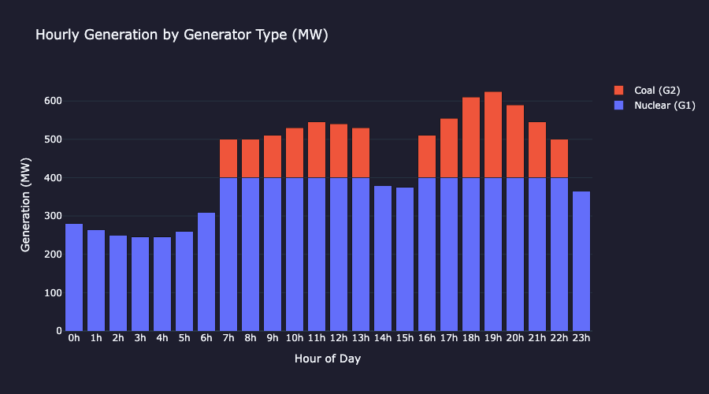
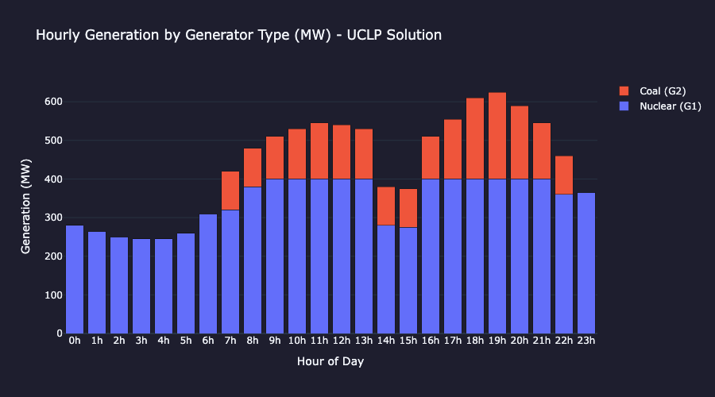
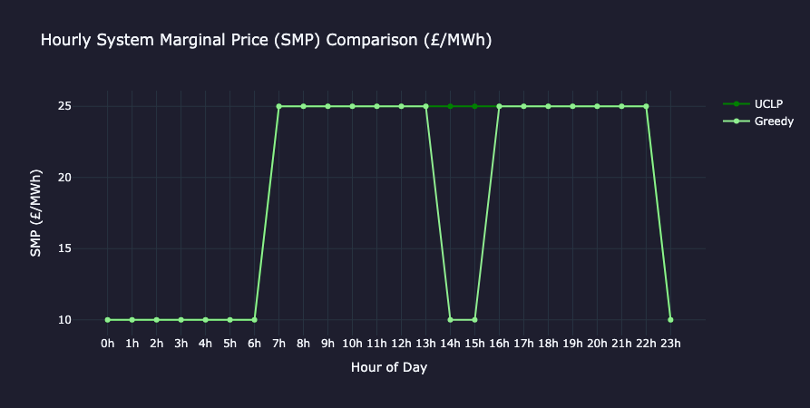
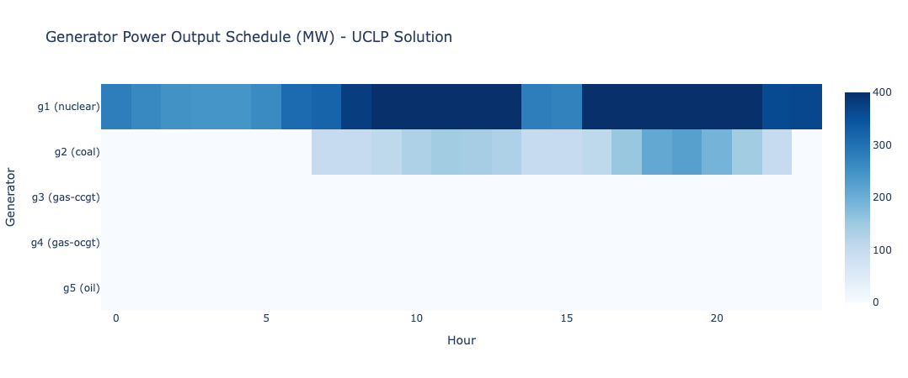

# Power Market Modelling — Onboarding Exercise

This is a self-contained intro exercise for getting a feel for how electricity markets work and how optimisation is used to operate them. It was generated by Claude (Anthropic) as a learning exercise on request — the intent is to get hands-on with the core concepts before diving into real-world complexity.

---

## What this is

A 24-hour generator scheduling problem. You have a small fleet of five power plants and a demand profile. The challenge is to figure out which generators to run, when, and at what output — at minimum cost.

This touches two of the most fundamental problems in power systems:

- **Economic Dispatch** — given which generators are on, how much should each produce?
- **Unit Commitment** — which generators should be on at all?

These are real problems that grid operators and energy traders deal with every day.

---

## The exercise (in three parts)

### Part 1 — Greedy merit order dispatch
The simplest approach: just rank generators by marginal cost and fill demand from cheapest to most expensive. No startup costs, no minimum run times — just a greedy baseline.

You'll produce a generation mix chart and a System Marginal Price (SMP) curve. The SMP is the price set by the most expensive generator needed to meet demand — this is how real electricity markets price power.

### Part 2 — Unit Commitment with Linear Programming
Now add the real constraints: startup costs, minimum run times, minimum stable generation. Formulate this as a Mixed-Integer Linear Programme (MILP) using `PuLP` and solve it optimally.

You'll see how much cheaper the optimised schedule is versus the greedy one, and why — the solver avoids unnecessary start-ups and keeps cheap baseload (nuclear) running continuously.

### Part 3 — Analysis
Explore what the results mean: price duration curves, the effect of startup costs on the schedule, and identifying scarcity hours.

---

## Generator fleet

| Generator | Type       | Capacity (MW) | Marginal Cost (£/MWh) | Startup Cost (£) | Min Run Time (hrs) |
|-----------|------------|:---:|:---:|:---:|:---:|
| G1        | Nuclear    | 400 | £10  | £50,000 | 8 |
| G2        | Coal       | 300 | £25  | £8,000  | 4 |
| G3        | Gas (CCGT) | 200 | £45  | £2,000  | 2 |
| G4        | Gas (OCGT) | 100 | £80  | £500    | 1 |
| G5        | Oil Peaker | 50  | £120 | £200    | 1 |

Nuclear is cheap to run but expensive to start and slow to ramp — it wants to run all day. Oil peakers are the opposite: expensive per MWh but quick and cheap to commit, so they only appear at peak hours.

---

## Key concepts you'll encounter

**System Marginal Price (SMP)** — the marginal cost of the last (most expensive) generator dispatched. All generators in the market receive this price, regardless of their own cost. This is why cheap generators are profitable.

**Merit order** — ranking generators by marginal cost. The cheapest runs first, the most expensive only when needed. The shape of this stack determines the price.

**MILP (Mixed-Integer Linear Programming)** — an optimisation technique where some variables are continuous (how much power to produce) and some are binary (on or off). The solver finds the globally optimal solution subject to all constraints.

**Startup cost vs marginal cost trade-off** — the tension at the heart of unit commitment. It might be cheaper to keep an expensive generator running overnight than to shut it down and pay to restart it the next morning.

---

## Repository structure

```
├── task.md               # The original problem statement as given by Claude
├── my_solution.ipynb     # Main notebook — work through Parts 1, 2, and 3 here
├── claude_solution.py    # Claude's own reference solution as a plain Python script
├── plotting.py           # Reusable Plotly chart functions used by the notebook
├── figures/              # Exported chart images referenced in this README
```

---

## How to run

```bash
pip install pulp plotly pandas tqdm
jupyter notebook my_solution.ipynb
```

The notebook is self-contained. `plotting.py` holds the reusable chart functions.

---

## Results (spoiler)

| Method | Marginal Cost | Startup Cost | Total Cost |
|---|---|---|---|
| Greedy merit order | £135,500 | £66,000 | £201,500 |
| MILP unit commitment | £137,100 | £58,000 | £195,100 |
| Saving | | | **£6,400** |

Note that the MILP actually has a slightly *higher* marginal cost than greedy — it trades a little extra running cost for significantly fewer start-ups, coming out ahead overall.

---

### Generation mix — greedy dispatch



The greedy solution is clean and intuitive: nuclear (G1) runs all 24 hours as the baseload, and coal (G2) fills in from hour 7 onwards when morning demand ramps above nuclear's 400 MW capacity. The three gas and oil generators are never needed — this demand profile is comfortably within the two cheapest generators. The night trough (hours 0–6) and late evening (hour 23) are nuclear-only, setting the SMP at £10/MWh.

---

### Generation mix — MILP (unit commitment) dispatch



The MILP schedule looks similar at a glance, but there is a key difference at hours 14–15, where demand dips to ~375–380 MW — within nuclear's solo capacity. The greedy solution switches coal off; the MILP keeps it running at its minimum stable generation (100 MW), with nuclear backing off to compensate. This is the minimum run time constraint in action: coal was committed in the morning and must run for at least 4 hours, so the solver finds it cheaper to leave it idling than to incur another £8,000 startup later in the evening peak.

---

### SMP comparison — greedy vs MILP



Both solutions produce the same SMP curve for the vast majority of the day: £10/MWh overnight (nuclear is the marginal unit) and £25/MWh through the daytime (coal is marginal). The two lines are nearly identical, which tells you something important: the *commitment* decisions changed, but the *price signal* is almost unaffected. In real markets, small changes in which unit is marginal can have large price implications — this problem is simple enough that it doesn't show that complexity.

---

### Optimal commitment schedule (heatmap)



The heatmap shows the MILP output schedule across all generators and hours. The key takeaways: G1 (nuclear) is committed for all 24 hours, running harder during the evening peak (darker blue) and lighter overnight. G2 (coal) operates during the high-demand daytime window, with a faint band at hours 14–15 reflecting minimum stable generation. G3, G4, and G5 are never dispatched — the demand profile simply never pushes high enough to need them.

---

## Conclusions and Reflections

- This exercise built a simple but complete power market model from scratch, covering merit order dispatch, unit commitment as a MILP, and market price formation. For a first encounter with the domain, it covered a surprising amount of ground.

- The core insight from the UC formulation is that optimal scheduling is not just about cheapest generation hour by hour, startup costs and minimum runtime mean. The truly least-cost solution sometimes keeps generators running through periods where they aren't strictly needed.

- On the market side, the SMP mechanism illustrates why scarcity events are so financially consequential: the system had 425 MW of headroom at peak, with an SMP of £25/MWh. Had demand risen by just 375 MW more, Oil would have set the price at £120/MWh, a nearly 5× jump driven by a relatively small supply-demand imbalance.

- This dynamic likely plays out at seasonal scale too, particularly in countries with significant weather variation, where heating and cooling cycles introduce a predictable but large demand swing on top of the daily pattern.

- From a technical standpoint, the exercise was a genuinely useful bridge, connecting familiar tools (constrained optimisation, objective function design, binary variables) to an unfamiliar domain. PuLP made the formulation clean and readable, though tackling a more complex real-world dataset would be the natural next step to stress-test both the model and the solver.

*Exercise devised by Claude (Anthropic) as an introduction to power market modelling.*
